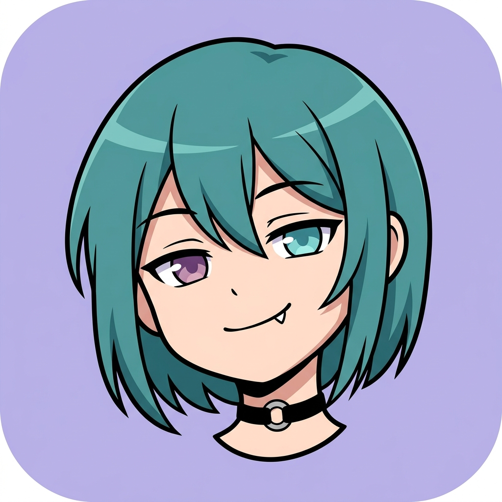

<div align="center">



# charshare

**Decentralized, unmoderated platform to share and talk to AI characters.**

[](LICENSE)
[](https://kit.svelte.dev)
[](https://nostr.com)
[](https://wails.io)

[Live app](https://jim-ww.github.io/charshare/) · [Releases](https://github.com/jim-ww/charshare/releases) · [Legal](https://jim-ww.github.io/charshare/legal)

</div>

---

## What is this

charshare lets you create, publish, and chat with AI characters — without signing up, a server, or anyone standing between you and the network.

- **Local-first.** Everything you do — characters, chats, personas, preferences — lives on your device first. Publishing to the network is a choice, not a requirement.
- **No backend.** charshare ships as a static site (deployable from any CDN) or a desktop binary. There is no server of ours in the loop.
- **Peer-to-peer.** Anything you publish travels over [Nostr](https://nostr.com), an open relay-based protocol, through relays anyone can run — including you.
- **You own your identity.** Users and characters are identified by a public key, not a username/password pair. Every event is signed client-side per the Nostr protocol (secp256k1); nothing you publish can be forged or reassigned by anyone else, including a relay operator.
- **Bring your own AI.** Configure OpenRouter, Hugging Face, or a self-hosted Ollama instance. Your key, your requests, straight from your device to the provider you chose.
- **Free as in freedom.** AGPLv3. Run it, read it, modify it, fork it, self-host a relay.

## Features

| | |
|---|---|
| **Browse** | Search by name, tag, or `@username`/`@pubkey`; block tags/authors locally |
| **Characters** | Create, edit, fork, delete; signed version history; local-only or published; comments |
| **Chats** | Local-only, branching message tree (on edit/regenerate), personas, backgrounds, import/export as JSON |
| **Profiles** | Signed profile documents, `@username` claims, searchable name index |

## Try it

- **In the browser**, no install: **[jim-ww.github.io/charshare](https://jim-ww.github.io/charshare/)**
- **As a desktop app**, download a binary from [Releases](https://github.com/jim-ww/charshare/releases) (Linux, Windows, macOS)
- **Via Nix, try it or add it to your flake**:

  ```sh
  nix run github:jim-ww/charshare
  ```

## Building from source

The frontend (SvelteKit + Tailwind/DaisyUI) is wrapped in a [Wails](https://wails.io) desktop shell, but also builds standalone as a static site — same code, either target.

### With Nix (recommended)

```sh
nix build           # produces the desktop binary at ./result/bin/charshare
```

### Without Nix

Requires Go 1.23+, [Wails CLI](https://wails.io/docs/gettingstarted/installation), Node.js, and pnpm. On Linux you'll also need `webkit2gtk` (4.1) and `gtk3` dev packages.

```sh
cd frontend && pnpm install && cd ..
wails build         # desktop binary in ./build/bin
```

To build the frontend alone as a static site (no Wails/Go needed):

```sh
cd frontend
pnpm install
pnpm run build      # outputs to frontend/dist
```

## Legal

Users are solely responsible for content they publish, under the laws of their own jurisdiction — charshare is software, not a service, and takes no responsibility for what anyone does with it. There is no server, no signup, and no one positioned to moderate or remove anything on our end. See [`/legal`](https://jim-ww.github.io/charshare/legal) for the full statement.

## Support the Project

charshare has no subscription and no ads, and never will. If you'd like to support it anyway, donations are welcome.

**Monero (XMR)**
```
83YGRqP8uHed6NeegZQeX9ccCxbzoRHHEEi7pTwk4aqdJZEVXXA6NWtetnsEM2v33zFBBt3Rp6DNhU9qhJEGPspU14yN8t7
```

## License

[AGPLv3](LICENSE). Free to use, study, share, and modify — provided you keep the same freedoms for others.
